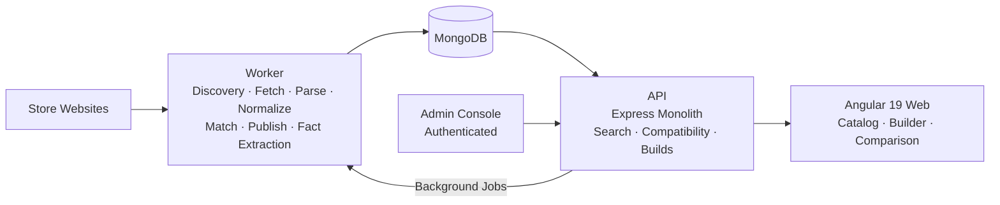

# BuildSense

**Egyptian PC hardware catalog, compatibility engine, and purchasing-assistance platform.**

Aggregates product data and pricing from multiple Egyptian hardware stores into a single catalog, runs rule-based compatibility checks on selected components, and generates purchase plans that link users directly to the original stores — no payment processing involved.

---

## Table of Contents

- [Overview](#overview)
- [Key Features](#key-features)
- [Architecture](#architecture)
- [Tech Stack](#tech-stack)
- [Getting Started](#getting-started)
- [Author](#author)

---

## Overview

BuildSense solves a real problem in the Egyptian PC hardware market: pricing, availability, and compatibility information is scattered across multiple stores with no unified view. The platform aggregates products from several Egyptian retailers, normalizes specs into a canonical format, and exposes a single searchable catalog with an interactive PC builder that checks component compatibility before purchase.

### Data Pipeline

```
Store Websites → Worker Discovery → Fetch & Snapshot → Parse → Normalize → Match → Publish
```

Each store gets a dedicated adapter that knows how to discover, fetch, and parse its HTML. Raw snapshots are stored immutably before normalization, ensuring a reliable audit trail. The worker publishes canonical products and store-specific offers with prices, availability status, and direct source links.

---

## Key Features

### Multi-Store Aggregation

Collects product listings from multiple Egyptian hardware retailers using dedicated store-specific adapters. Each adapter handles discovery, fetching, HTML parsing, and spec normalization for its target store.

Supported stores: **Sigma Computer**, **El Badr Group**, **El Nour Tech**, **Alfrensia Computer**.

---

### Components Catalog

A searchable, filterable catalog with category browsing, sorting, and pagination. Product cards show key specs, pricing, and store source at a glance. Detailed product pages include full specification tables, image galleries, and links to every available offer at the originating store.

<p align="center">
  
</p>

<p align="center">
  
</p>

#### Responsive

| Mobile Catalog | Mobile Product Details |
| --- | --- |
|  |  |

---

### PC Builder

An interactive builder with 8 component slots (CPU, Motherboard, GPU, RAM, Storage, PSU, Case, Cooler). Selecting a slot opens a filtered candidate selector showing only compatible components. Builds persist as guest sessions with estimated totals, and the compatibility status and reasons for each pairing are displayed inline.

| Builder | Candidate Selector |
| --- | --- |
|  |  |

---

### Compatibility Engine

A rule-based engine that evaluates component pairs against extracted hardware facts. Each check returns one of three states: **COMPATIBLE**, **INCOMPATIBLE**, or **UNKNOWN**. The engine reports which fact keys were missing for undecidable pairs rather than guessing. Coverage is currently **P0/experimental** — the most common relationships are supported, but some combinations may return UNKNOWN as fact extraction and rule coverage continue to expand.

<p align="center">
  
</p>

---

### Product Comparison

Select two products from the catalog and view a side-by-side comparison of specifications, pricing, and store availability. Makes cross-store differences visible in a single view.

<p align="center">
  
</p>

---

### Purchase Planning

Review a completed build with per-component offer cards linking to each store's product page. The plan includes a build summary, estimated total, and export, print, and PDF controls for saving a copy.

<p align="center">
  
</p>

---

### Background Data Pipeline

The worker runs as a background process, managing the full ingestion lifecycle: store discovery, page fetching, immutable raw snapshot capture, HTML parsing, spec normalization, product matching against the canonical catalog, offer publishing, and compatibility fact extraction. The pipeline supports resumable runs and idempotent publishing.

<p align="center">
  
</p>

---

### Admin Operations Console

An authenticated admin backend with role-based access covering operational views: overview dashboard, scrape run monitoring, match review workflows, data quality insights, eligibility overrides, worker job management, and compatibility quality metrics. Sessions use CSRF-protected opaque tokens with origin verification and audit logging.

<p align="center">
  
</p>

---

## Architecture

BuildSense follows a monorepo architecture with clear separation between the three applications — a public Angular web app, an Express API, and a background worker — plus shared domain and infrastructure packages. The worker owns all data ingestion (scraping, normalization, matching, publishing), the API serves read-heavy catalog queries and compatibility checks, and the web app provides the user-facing catalog, builder, and comparison UI.



**Dependency rule:** No app imports another app. No package above the boundary imports from below.

---

## Tech Stack

| Category | Technology |
| --- | --- |
| **Runtime** | Node.js 24.18.0, TypeScript 5.8, ESM |
| **Monorepo** | npm workspaces, Nx 23 |
| **Web** | Angular 19 |
| **API** | Express |
| **Database** | MongoDB / Mongoose |
| **Scraping** | Cheerio |
| **Testing** | Vitest, Playwright, axe-core accessibility |
| **Linting / Formatting** | ESLint 9, Prettier 3 |
| **Logging** | Pino (via observability package) |

---

## Getting Started

### Prerequisites

- **Node.js** `24.18.0` (see `.nvmrc`) and npm
- **MongoDB** — a local instance or MongoDB Atlas connection

### Install and Configure

```bash
git clone <repository-url>
cd buildsense
npm ci
cp .env.example .env
```

> On Windows PowerShell: `Copy-Item .env.example .env`

Edit `.env` and set `MONGO_URI` to your MongoDB connection string.

### Run

All runtimes must start from the repository root so dotenv loads `.env` correctly. Start each in a separate terminal:

```bash
npx nx dev api       # API server
npx nx serve web     # Web development server
npm run worker -- health   # Worker health check (verifies DB connectivity)
```

Or run everything together:

```bash
npm run dev
```

---

## Author

**Nour Eldeen Mahmoud**

- GitHub: [NourEldeenMahmoud](https://github.com/NourEldeenMahmoud)
- LinkedIn: [nour-eldeen-eg](https://linkedin.com/in/nour-eldeen-eg)
