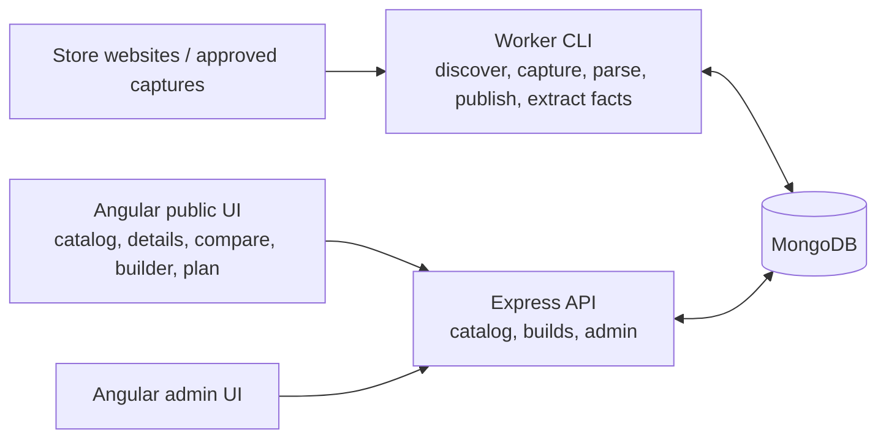

# BuildSense

<div align="center">
  <p><strong>Egyptian PC hardware discovery, compatibility, and purchase planning.</strong></p>
  <p>
    BuildSense combines products and store offers in one catalog, evaluates PC builds with
    explainable compatibility rules, and sends shoppers to the original retailer to buy.
  </p>
  <p>
    
    
    
    
    
  </p>
</div>

> BuildSense does not sell products or process payments. Prices and availability are observed
> from source stores, and checkout always happens on the retailer's website.

## Contents

- [Feature Tour](#feature-tour)
  - [Home and Component Discovery](#home-and-component-discovery)
  - [Product Details and Store Offers](#product-details-and-store-offers)
  - [Persistent PC Builder](#persistent-pc-builder)
  - [Compatibility Engine](#compatibility-engine)
  - [Product Comparison](#product-comparison)
  - [Purchase Plan](#purchase-plan)
  - [Multi-Store Data Pipeline](#multi-store-data-pipeline)
  - [Admin Operations Console](#admin-operations-console)
- [Responsive UI](#responsive-ui)
- [Architecture](#architecture)
- [Repository Layout](#repository-layout)
- [Tech Stack](#tech-stack)
- [Getting Started](#getting-started)
- [Useful Commands](#useful-commands)
- [Current Boundaries](#current-boundaries)
- [Author](#author)

## Feature Tour

### Home and Component Discovery

The public home page is also the component catalog. It provides:

- Debounced search across product title, brand, model, and MPN.
- Category and brand filters, price range filters, and removable active-filter chips.
- Price and recency sorting with URL query parameters as the filter source of truth.
- Paginated inventory with compact cards for brand, product name, category, current price,
  availability, and up to two useful specifications.
- Honest fallback states when a price, availability value, image, or useful specification is
  genuinely unavailable.

<p align="center">
  
</p>

<p align="center">
  
</p>

The legacy `/catalog` route preserves query parameters and redirects to the home catalog.

### Product Details and Store Offers

Each product detail page combines catalog identity and store-specific commercial data:

- Product gallery, brand, model, MPN, and category.
- Current observed price and availability.
- Direct link to the selected source offer.
- A multi-offer section when the same catalog product has more than one store offer.
- Raw store specifications in their captured order.
- Builder entry point for eligible components.

<p align="center">
  
</p>

### Persistent PC Builder

The builder stores guest builds through the API under a public build ID. A build contains eight
slots:

| CPU | Motherboard | RAM | GPU | Storage | PSU | Case | Cooling |
| --- | --- | --- | --- | --- | --- | --- | --- |

Builder capabilities include:

- Create, rename, reopen, and update a persisted build.
- Search candidates within the selected slot's accepted categories.
- Filter candidates by availability and load additional result pages.
- See multi-store offer alternatives with deterministic current-offer selection.
- Group candidates by compatible, compatible with warnings, unknown, or incompatible status.
- Show rule reasons and missing fact keys instead of inventing a compatibility answer.
- Keep pricing and compatibility snapshots synchronized after build mutations.

| Build Workspace | Component Selector |
| --- | --- |
|  |  |

### Compatibility Engine

Compatibility is rule-based and explainable. The worker extracts structured hardware facts from
catalog specifications, and the API evaluates those facts when a build changes.

Implemented rule families cover:

- CPU and motherboard socket matching.
- Motherboard and RAM generation, module type, slot count, capacity, and speed.
- Motherboard form factor support in a case.
- GPU length and expansion-slot clearance.
- PSU wattage against observed CPU and GPU power facts.
- Storage interface support and integrated/discrete graphics requirements.

Results are `COMPATIBLE`, `WARNING`, `INCOMPATIBLE`, or `UNKNOWN`. `UNKNOWN` is intentional when
required facts or rule coverage are missing. Some declared rules remain reference-data dependent or
stubbed, so compatibility coverage should be treated as an expanding decision aid rather than a
replacement for manufacturer documentation.

<p align="center">
  
</p>

### Product Comparison

The comparison page lets users select two real catalog products and review:

- Product identity and imagery.
- Current observed price, availability, and source store.
- A union of raw specification labels from both products.
- Highlighted specification rows whose values differ.
- Explicit missing-value markers when only one product provides a specification.

<p align="center">
  
</p>

### Purchase Plan

A persisted build can be opened as a purchase plan using its public build ID. The plan provides:

- One row per selected component with quantity, price, and source store.
- Direct retailer links for the selected offers.
- Estimated build total and compatibility summary.
- JSON export for a portable build record.
- Print styles and browser print-to-PDF support.

<p align="center">
  
</p>

### Multi-Store Data Pipeline

BuildSense currently recognizes four store codes and human-readable labels:

| Store | Integration |
| --- | --- |
| Sigma Computer | HTTP discovery, category/product parsing, bootstrap import, and live samples |
| El Badr Group | HTTP discovery, URL/category imports, snapshot publishing, and live samples |
| El Nour Tech | Store adapter plus browser-capture manifest import for protected pages |
| Alfrensia Computer | Store adapter plus URL, snapshot, and browser-capture imports |

The worker owns ingestion end to end:

```text
Store page or approved capture
        |
        v
Discovery -> Fetch -> Immutable raw snapshot -> Parse -> Normalize
        -> Identity matching -> Catalog/offer publish -> Compatibility fact extraction
```

Operational properties include:

- Immutable compressed HTML snapshots with content hashes.
- Store-scoped scrape runs, locks, item progress, retries, and resumable imports.
- Exact GTIN or normalized brand-and-MPN evidence for confident cross-store identity matching.
- Idempotent offer publishing by store and external product ID.
- Offline import of user-captured HTML without bypassing store access protections.
- Separate compatibility-fact extraction and category quality reports.

### Admin Operations Console

The Angular admin console is protected by an admin session and exposes operational workflows for:

- Catalog, offer, scrape-run, quality, and worker status metrics.
- Scrape-run history and per-run details.
- Product match review: link to an existing product, ignore, or create a new product.
- Data-quality issue review and resolution.
- Builder eligibility overrides.
- Compatibility fact coverage and rule readiness.
- Reprocessing and fact-backfill jobs processed asynchronously by the worker.

Admin authentication uses a single current `ADMIN` role, scrypt password hashes, opaque session
cookies, CSRF protection for writes, strict origin checks, login throttling, and audit records for
mutating operations.

| Login | Operations Overview |
| --- | --- |
|  |  |

| Scrape Runs | Match Reviews |
| --- | --- |
|  |  |

| Data Quality | Compatibility Quality |
| --- | --- |
|  |  |

## Responsive UI

The public catalog, product details, builder, and candidate selector adapt to narrow screens. Touch
layouts preserve the same data and actions without requiring hover.

| Home | Catalog | Product Details |
| --- | --- | --- |
|  |  |  |

| Builder | Component Selector |
| --- | --- |
|  |  |

## Architecture

BuildSense is an Nx monorepo with three runtime applications and shared packages. The API never
scrapes a store, and the web application never accesses MongoDB directly.



Admin job requests are written through the API to MongoDB. The worker claims and processes those
jobs separately; the API does not execute ingestion work inside an HTTP request.

### Dependency Direction

```text
web     -> contracts, domain, config
api     -> contracts, domain, database, compatibility-engine, observability, config
worker  -> domain, database, scraping-core, store adapters, compatibility facts,
           observability, config
```

No application imports another application. Raw store parsing remains inside store adapters, shared
crawling behavior remains in `scraping-core`, and compatibility rules remain in
`compatibility-engine`.

## Repository Layout

```text
apps/
  web/                 Angular public and admin UI
  api/                 Express REST API
  worker/              Ingestion, publishing, fact extraction, and admin-job CLI

packages/
  contracts/           Transport DTOs and shared enums
  domain/              Infrastructure-free domain types and rules
  database/            Mongoose models and repositories
  compatibility-engine/
  compatibility-facts/
  scraping-core/
  sigma-adapter/
  el-badr-adapter/
  el-nour-adapter/
  alfrensia-adapter/
  config/
  observability/
  test-support/

docs/                  ADR, PRD, TDD, and screenshots
fixtures/              Parser and captured-page fixtures
scripts/               Bootstrap, verification, and browser-capture tools
```

## Tech Stack

| Area | Technology |
| --- | --- |
| Runtime | Node.js 24.18.0, TypeScript 5.8, ES modules |
| Monorepo | npm workspaces, Nx 23 |
| Web | Angular 19, RxJS |
| API | Express, OpenAPI/Swagger UI |
| Database | MongoDB, Mongoose |
| Worker | Commander CLI, Cheerio-based store adapters |
| Security | Helmet, CORS, scrypt, opaque sessions, CSRF and origin validation |
| Observability | Pino structured logging, request IDs, readiness/liveness endpoints |
| Testing | Vitest, MongoDB Memory Server, Playwright, axe-core |
| Quality | ESLint 9, Prettier 3, strict TypeScript |

## Getting Started

### Prerequisites

- Node.js `24.18.0` (see `.nvmrc`).
- npm.
- A local MongoDB instance or MongoDB Atlas connection.

### Install

```bash
git clone https://github.com/NourEldeenMahmoud/BuildSense.git
cd BuildSense
npm ci
cp .env.example .env
```

PowerShell equivalent:

```powershell
Copy-Item .env.example .env
```

### Configure

Set these values in `.env`:

| Variable | Required | Default / purpose |
| --- | --- | --- |
| `MONGO_URI` | Yes | MongoDB connection string |
| `MONGO_DB_NAME` | No | `buildsense` |
| `API_PORT` | No | `3000` |
| `LOG_LEVEL` | No | `info` |
| `DNS_SERVERS` | No | Optional comma-separated DNS servers for Atlas connectivity |
| `WEB_ORIGIN` | No | `http://localhost:4200` |
| `SESSION_MAX_AGE_HOURS` | No | `24` |

### Run the Applications

Start the API and web application in separate terminals from the repository root:

```bash
npx nx run api:dev
npx nx run web:serve
```

Or start both development targets together:

```bash
npm run dev
```

Local endpoints:

| Service | URL |
| --- | --- |
| Web | `http://localhost:4200` |
| API | `http://localhost:3000` |
| Swagger UI | `http://localhost:3000/api/docs` |
| Liveness | `http://localhost:3000/health/live` |
| Readiness | `http://localhost:3000/health/ready` |

### Create an Admin Account

The command prompts for the password instead of accepting it as a command-line argument:

```bash
npx nx run worker:start --args="admin seed --email admin@example.com"
```

Then open `http://localhost:4200/admin/login`.

## Useful Commands

### Validation

```bash
npm run lint
npm run typecheck
npm test
npm run build
```

Focused Nx targets are also available:

```bash
npx nx run web:test
npx nx run api:test
npx nx run worker:test
npx nx run web:e2e
```

### Worker

```bash
npx nx run worker:start --args="health"
npx nx run worker:start --args="--help"
npx nx run worker:start --args="compatibility extract"
npx nx run worker:start --args="admin-jobs --once"
npx nx run worker:start --args="admin-jobs --poll --interval 30000"
```

Store-specific commands are grouped under `sigma`, `el-badr`, `el-nour`, and `alfrensia`. Use the
CLI help before running ingestion against a store:

```bash
npx nx run worker:start --args="sigma --help"
npx nx run worker:start --args="el-badr --help"
npx nx run worker:start --args="el-nour --help"
npx nx run worker:start --args="alfrensia --help"
```

## Current Boundaries

- Store prices and availability can change after observation; users should confirm on the retailer
  page.
- Compatibility returns `UNKNOWN` when required facts are absent and still has reference-data and
  stubbed rule gaps.
- Bundles can appear in the catalog but cannot be selected as builder components.
- El Nour Tech and Alfrensia support approved browser-capture imports when automated HTTP access is
  challenged. BuildSense does not bypass CAPTCHAs or store access protections.
- The current admin authorization model has one `ADMIN` role.
- Payments, checkout, delivery, and order management are outside the platform.

## Author

**Nour Eldeen Mahmoud**

- GitHub: [NourEldeenMahmoud](https://github.com/NourEldeenMahmoud)
- LinkedIn: [nour-eldeen-eg](https://linkedin.com/in/nour-eldeen-eg)
